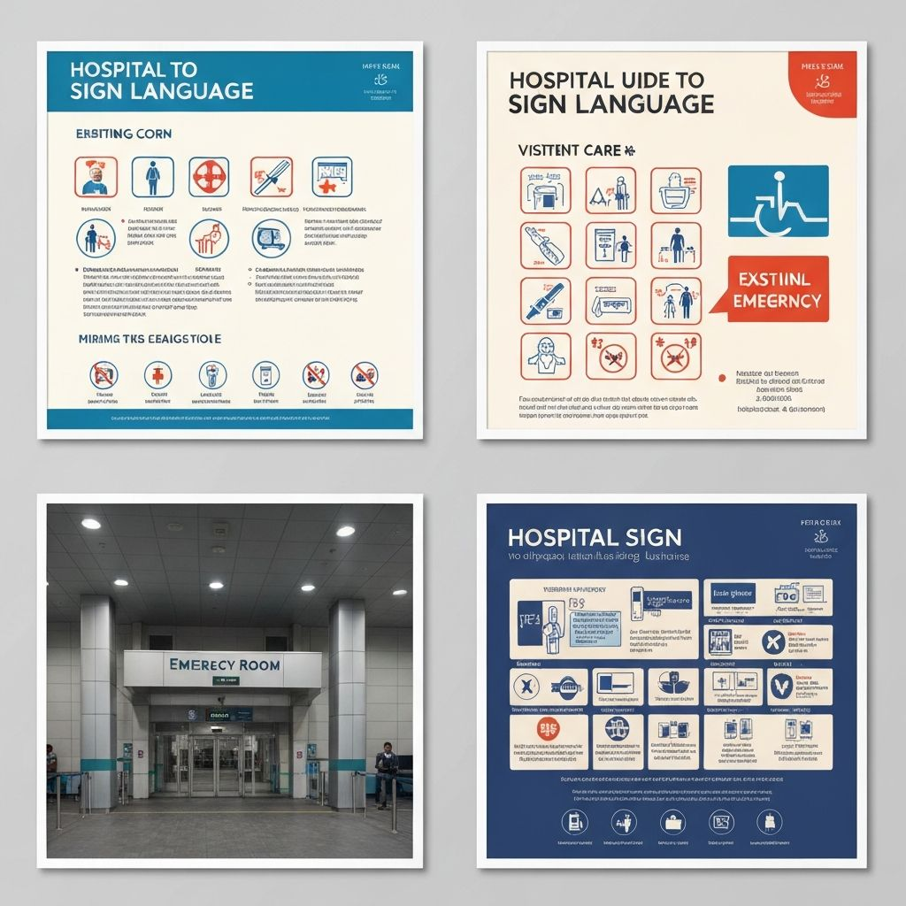

# 🖐️ SonDam (손담) - 청각장애인을 위한 수어 소통 플랫폼

> **"손으로 나누는 따뜻한 이야기"**
> 청각장애인과 비장애인의 소통 장벽을 허무는 AI 기반 수어 번역 및 검색 서비스


   

       
<br>       
  
## 서비스 화면 (Service Preview)   
| **메인 홈 & 수어 사전** | **AI 수어 번역 (UI)** | 
| :---: | :---: |
|  |  |
| *직관적인 검색창과 추천 단어 카드* | *웹캠 기반 실시간 번역 인터페이스* |
 
| **3D 수어 아바타** | **커뮤니티 & 로그인** |
| :---: | :---: |
|  |  |
| *텍스트를 수어로 표현하는 3D 모델* | *사용자 간 소통 공간 및 인증* |

> *※ 현재 상황이며, 개발 진행 상황에 따라 업데이트됩니다.*
 
<br>

## 프로젝트 소개 (Project Overview)
**SonDam(손담)**은 '수어(Sign Language)'를 매개로 소통의 장벽을 낮추는 웹 플랫폼입니다.
`Next.js 14`의 강력한 성능과 `shadcn/ui`의 모던한 디자인 시스템을 결합하여, 누구나 쉽게 접근할 수 있는 **Barrier-Free** 웹사이트를 구축했습니다.

  

### 핵심 목표
1. **쉬운 접근성:** 복잡한 설치 없이 웹에서 바로 검색하고 학습
2. **AI 확장성:** 단순 사전을 넘어, 향후 AI 모델(YOLO, STT) 탑재를 고려한 모듈형 설계
3. **직관적 UI:** 청각장애인과 비장애인 모두에게 편안한 UX 제공

<br>

## 기술 스택 (Tech Stack)

### Frontend & UI
- **Framework:** Next.js 14 (App Router)
- **Language:** TypeScript
- **Styling:** Tailwind CSS
- **UI Components:** shadcn/ui (Radix UI 기반)
- **State Management:** React Context API (`auth-context.tsx`)

### Assets & Data
- **Icons:** Lucide React (`icon.svg`)
- **Images:** Public Assets (Educational & 3D Renderings)

<br>

## 프로젝트 구조 (Architecture)

핵심 기능별로 컴포넌트를 분리하여 유지보수성을 높였습니다.

```bash
.
├── app/                      # Next.js App Router (페이지 라우팅)
│   ├── login/ & signup/      # 사용자 인증 페이지
│   └── page.tsx              # 메인 랜딩 페이지
├── components/               # 재사용 가능한 UI 및 기능 모듈
│   ├── dictionary-page.tsx   # [기능 1] 수어 검색 사전 로직
│   ├── translator-page.tsx   # [기능 2] AI 번역 인터페이스
│   ├── avatar-page.tsx       # [기능 3] 3D 아바타 뷰어
│   ├── community-page.tsx    # 커뮤니티 게시판 컴포넌트
│   └── ui/                   # shadcn/ui 디자인 시스템 (Button, Card, Sheet 등 40+종)
├── contexts/                 # 전역 상태 관리
│   └── auth-context.tsx      # 로그인 상태 관리
└── public/                   # 정적 리소스 (이미지, 3D 모델 등)
```

## 주요 기능 (Features)

### 1. 수어 사전 (Dictionary)
- **파일 위치:** `components/dictionary-page.tsx`
- 텍스트 입력 시 데이터베이스(Mock Data)에서 매칭되는 수어 영상을 카드 형태로 출력합니다.
- 카테고리별 필터링 기능을 제공합니다.

### 2. AI 번역기 (Translator Interface)
- **파일 위치:** `components/translator-page.tsx`
- 웹캠 입력을 받을 수 있는 UI가 구현되어 있습니다.
- 향후 **YOLO 모델**을 연동하여 실시간 손 동작 인식을 수행할 예정입니다.

### 3. 수어 아바타 (3D Avatar)
- **파일 위치:** `components/avatar-page.tsx`
- 텍스트나 음성을 입력하면 3D 캐릭터가 수어 동작을 수행하는 뷰어입니다.
- 현재는 프로토타입 UI가 적용되어 있습니다.

<br>

## 실행 방법 (How to Run)


<details>
<summary><strong>Quickstart / 실행 가이드 펼치기</strong></summary>
  
  터미널에서 아래 명령어를 순서대로 입력하세요.
```bash
# 1. 저장소 복제
git clone [https://github.com/youngwoo28/SonDam.git](https://github.com/youngwoo28/SonDam.git)

# 2. 패키지 설치
npm install
# or
pnpm install

# 3. 개발 서버 실행
npm run dev
```

</details>

<br>

## 개발자 (Developer)
Youngwoo

Role: Full Stack Developer & AI Researcher

GitHub: @youngwoo28
